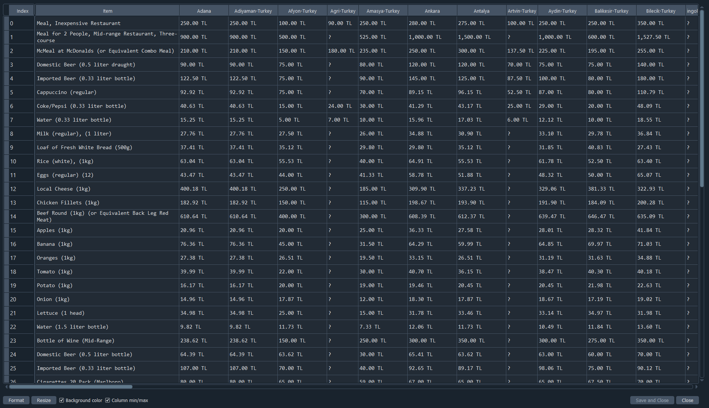

# Web Scraping Project - Cost of Living Data

This project scrapes cost of living data from **Numbeo** for various cities in Turkey. The scraped data is stored in an Excel file for further analysis. The project uses Python with the `requests` and `BeautifulSoup` libraries for web scraping, and `pandas` for data manipulation and saving the results.

## Features

- Scrapes cost of living data (prices of various items) for multiple Turkish cities.
- Handles errors if a city's data is unavailable or the page structure changes.
- Saves the scraped data into an Excel file.

## Table of Contents

- [Installation](#installation)
- [Usage](#usage)
- [Results](#results)

## Installation

1. Clone the repository to your local machine:

   ```bash
   git clone https://github.com/alicanuzumcu/Web-Scrapping-and-Data-Preprocessing-with-Python.git

2. Navigate into the project directory:
   
   ```bash
   cd Web-Scrapping-and-Data-Preprocessing-with-Python

3. Install the required dependencies using pip:

   ```bash
   pip install -r requirements.txt

## Usage

1. To run the script, simply execute the following command:

   ```bash
   python Web_Scrapping.py

## Results

Below is a screenshot of the results generated by the script:



Below is a screenshot of the final version of dataset after preprocessing:


